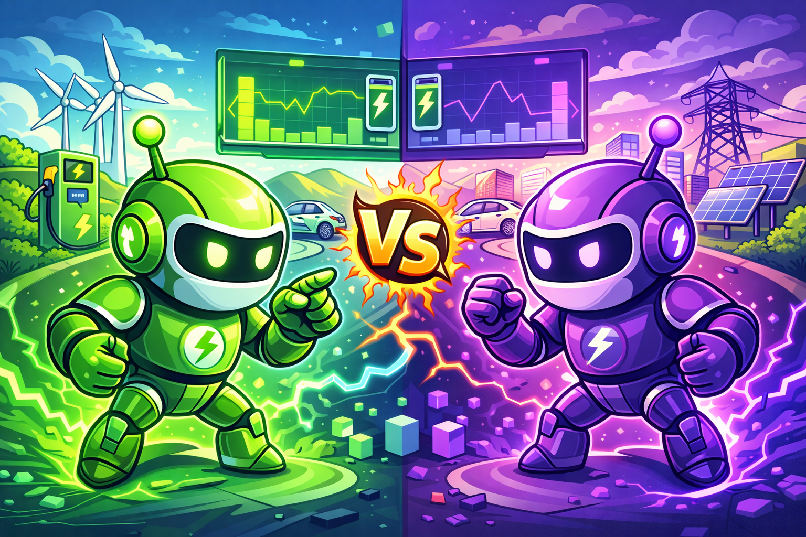

# EVChargeEnv – Green Agent Benchmark

<p align="center">
  
</p>

EVChargeEnv is a lightweight reinforcement learning environment for the AgentX – AgentBeats competition.  
It simulates **electric vehicle (EV) charging** under **dynamic electricity prices** and **variable grid load**.

The goal for a purple (assessee) agent is to:

- charge the battery to full,
- while minimizing cost,
- and avoiding grid overload.

---

## Environment Overview

- **State**:  
  `[charge_level, price, grid_load, time_step_norm]`

  - `charge_level` ∈ [0, 1]
  - `price` ∈ [0, 1] (fluctuating)
  - `grid_load` ∈ [0, 1] (fluctuating)
  - `time_step_norm` ∈ [0, 1] (normalized step index)

- **Action**:  
  Continuous charging rate `a` ∈ [0, 1].

- **Dynamics**:

  - Battery increases by `a * charge_rate_scale`.
  - Price and grid load follow noisy processes around scenario-specific baselines.
  - Different scenarios: `easy`, `medium`, `hard` (configured via `scenario` argument).

- **Reward (per step)**:

  - **+ progress_reward**: reward for moving charge toward full.
  - **− cost_penalty**: higher price × higher charging rate = more penalty.
  - **− overload_penalty**: penalty if charging when effective load exceeds a threshold.
  - **− small time_penalty**: encourages faster completion.

- **Episode ends when**:
  - battery is full, or
  - max number of steps is reached.

---

## Installation

```bash
pip install -r requirements.txt
```
